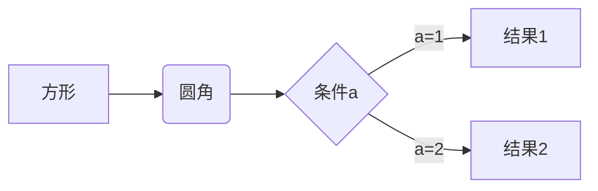
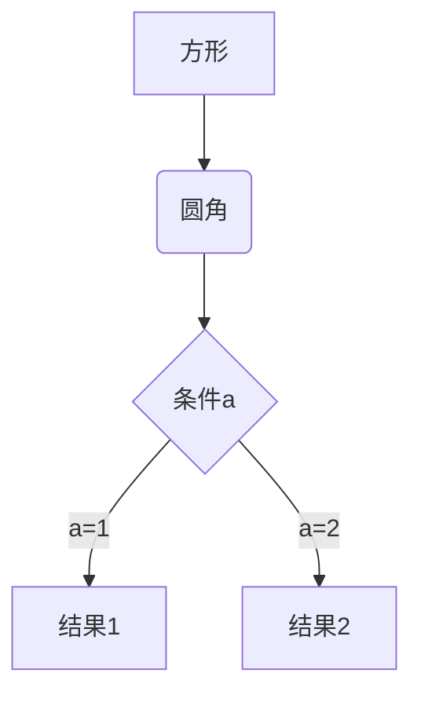
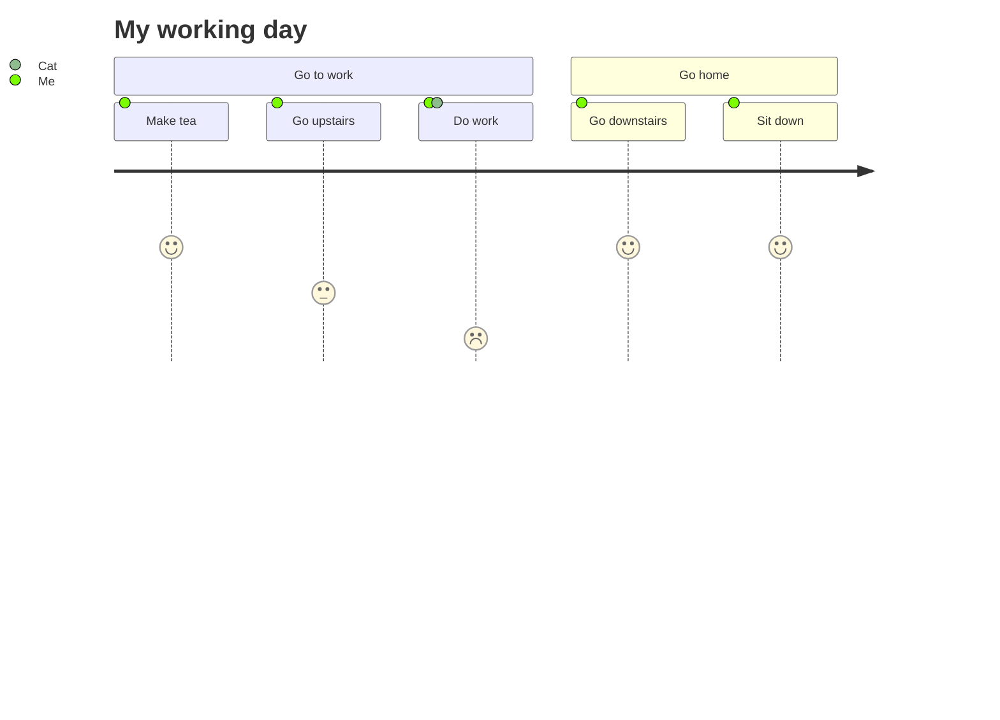
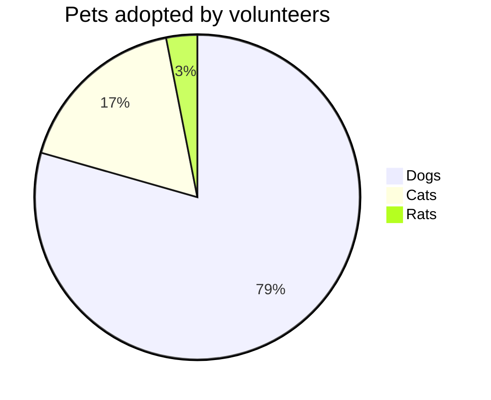
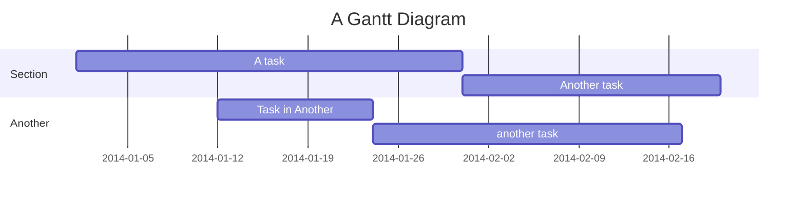
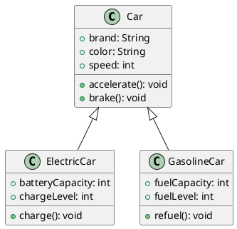

# Markdown语法基础教程

## 基础语法

### 标题
```
# 一级标题
## 二级标题
### 三级标题
#### 四级标题
##### 五级标题
###### 六级标题
```

### 文本样式
```
*斜体文本* _斜体文本_

**加粗文本** __加粗文本__

==标记文本==

~~删除文本~~

> 引用文本

H~2~O is是液体。

2^10^ 运算结果是 1024。
```

*强调文本* _强调文本_

**加粗文本** __加粗文本__

==标记文本==

~~删除文本~~

> 引用文本

H~2~O is 是液体。

2^10^ 运算结果是 1024。

### 列表
```
- 项目
  * 项目
    + 项目

1. 项目1
2. 项目2
3. 项目3


- [ ] 任务列表：计划任务、待办事项
- [x] 任务列表：完成任务

```

### 图片
```
图片: 
```

### 链接
```
链接: [link](https://www.csdn.net/)
```

### 代码块
```javascript
// An highlighted block
var foo = 'bar';
```

### 表格
```
项目     | Value
-------- | -----
电脑  | $1600
手机  | $12
导管  | $1

| Column 1 | Column 2      |
|:--------:| -------------:|
| centered 文本居中 | right-aligned 文本居右 |
```

项目     | Value
-------- | -----
电脑  | $1600
手机  | $12
导管  | $1

### 注脚
```
一个具有注脚的文本。[^1]

[^1]: 注脚的解释
```

## 高级语法

### Tex语法

一般需要前端使用 [KaTeX](work/programming/JavaScript/Library/Visualization/KaTeX.md) 或 [MathJax](work/programming/JavaScript/Library/Visualization/MathJax.md) 等工具才能实现文本解析和图像渲染。

#### Tex行内公式
```
$\sum_{x=0}^{n}$
```

求和公式：$\sum_{x=0}^{n}$

#### Tex公式块

```
$$
$\ce{Zn^2+  <=>[+ 2OH-][+ 2H+]  $\underset{\text{amphoteres Hydroxid}}{\ce{Zn(OH)2 v}}$  <=>[+ 2OH-][+ 2H+]  $\underset{\text{Hydroxozikat}}{\ce{[Zn(OH)4]^2-}}$}$
$$
```

$$
$\ce{Zn^2+  <=>[+ 2OH-][+ 2H+]  $\underset{\text{amphoteres Hydroxid}}{\ce{Zn(OH)2 v}}$  <=>[+ 2OH-][+ 2H+]  $\underset{\text{Hydroxozikat}}{\ce{[Zn(OH)4]^2-}}$}$
$$

### 图表类

需要注意的是，通过 DSL 语言来绘制图表，仅限于一些简单的图表，当图表比较复杂时，则建议使用专业的图形绘制工具来设计和生成，毕竟声明式语言的功能都十分有限，越是复杂的图表维护起来相比于专业软件，要困难得多。

一般推荐，使用 DSL 图形语言快速生成粗粒度且抽象的图形，然后使用 Draw IO 导入，再进行细节的美化，以及更详细的内容填充。

#### Mermaid

[Mermaid基础教程](work/methodology/Software-Engineering/Tools/Mermaid基础教程.md)

##### 流程图

从左到右


从上至下



##### 用户旅程图
User Journey Diagram


##### 饼图
Pie Chart



##### 甘特图



#### PlantUML

专业绘制 UML 图形的语法和开源工具，但并不算是流行，一般需要前端使用对应的工具才能进行文本解析和图像渲染。

https://github.com/plantuml/plantuml

##### UML 类图



## 参考链接

1. [Markdown 官方教程](https://markdown.com.cn/cheat-sheet.html)
2. [菜鸟教程-Markdown教程](https://www.runoob.com/markdown/md-tutorial.html)
3. [菜鸟教程-Markdown教程-Markdown高级教程](https://www.runoob.com/markdown/md-advance.html?tdsourcetag=s_pctim_aiomsg)
4. [Obsidian Markdown语法 超详细教程](https://forum-zh.obsidian.md/t/topic/435)