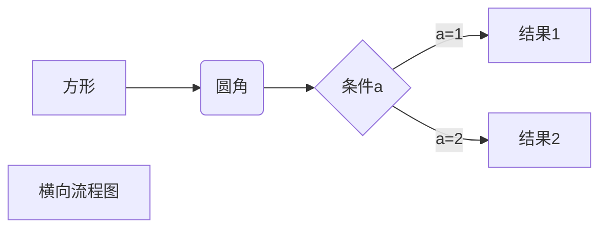
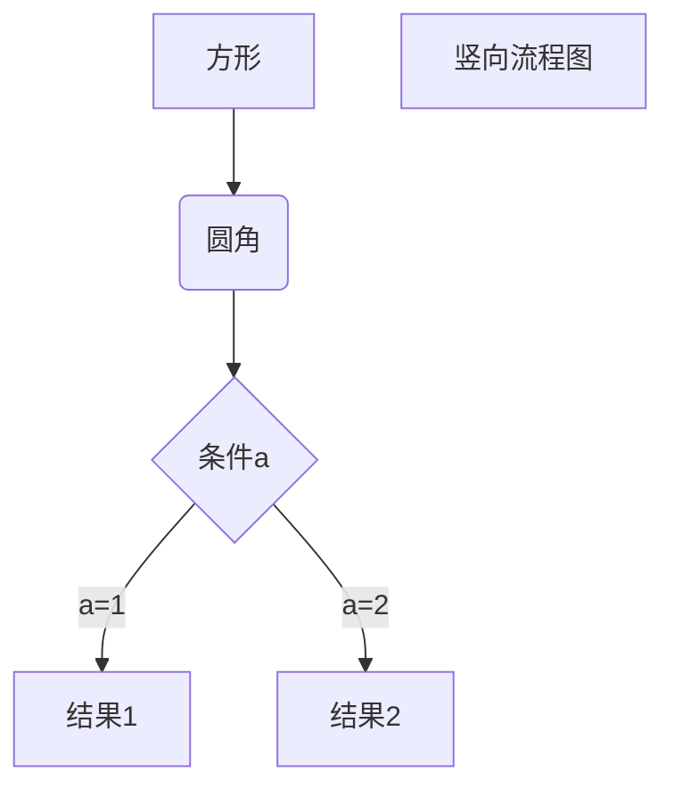
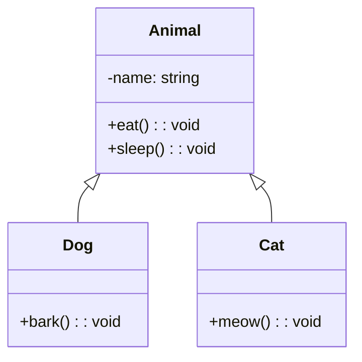

# Markdown语法基础教程


## 基础语法

### 标题
```
# 一级标题
## 二级标题
### 三级标题
#### 四级标题
##### 五级标题
###### 六级标题
```


### 文本样式
```
*强调文本* _强调文本_

**加粗文本** __加粗文本__

==标记文本==

~~删除文本~~

> 引用文本

H~2~O is是液体。

2^10^ 运算结果是 1024。
```

### 列表
```
- 项目
  * 项目
    + 项目

1. 项目1
2. 项目2
3. 项目3


- [ ] 任务列表：计划任务、待办事项
- [x] 任务列表：完成任务

```


### 图片
```
图片: 
```

### 链接
```
链接: [link](https://www.csdn.net/)
```


### 代码块
```javascript
// An highlighted block
var foo = 'bar';
```


### 表格
```
项目     | Value
-------- | -----
电脑  | $1600
手机  | $12
导管  | $1

| Column 1 | Column 2      |
|:--------:| -------------:|
| centered 文本居中 | right-aligned 文本居右 |
```

项目     | Value
-------- | -----
电脑  | $1600
手机  | $12
导管  | $1


### 注脚
```
一个具有注脚的文本。[^1]

[^1]: 注脚的解释
```


## 高级语法


### Tex语法


#### Tex行内公式
```
$\sum_{x=0}^{n}$
```

求和公式：$\sum_{x=0}^{n}$


#### Tex公式块

```
$$
$\ce{Zn^2+  <=>[+ 2OH-][+ 2H+]  $\underset{\text{amphoteres Hydroxid}}{\ce{Zn(OH)2 v}}$  <=>[+ 2OH-][+ 2H+]  $\underset{\text{Hydroxozikat}}{\ce{[Zn(OH)4]^2-}}$}$
$$
```


$$
$\ce{Zn^2+  <=>[+ 2OH-][+ 2H+]  $\underset{\text{amphoteres Hydroxid}}{\ce{Zn(OH)2 v}}$  <=>[+ 2OH-][+ 2H+]  $\underset{\text{Hydroxozikat}}{\ce{[Zn(OH)4]^2-}}$}$
$$

### 图

#### Mermaid

[Mermaid](work/note/programming-language/JavaScript/Libraries/Mermaid.md)

##### 横向流程图




##### 竖向流程图





##### UML



## 参考链接

1. [Markdown 官方教程](https://markdown.com.cn/cheat-sheet.html)
2. [菜鸟教程-Markdown教程](https://www.runoob.com/markdown/md-tutorial.html)
3. [菜鸟教程-Markdown教程-Markdown高级教程](https://www.runoob.com/markdown/md-advance.html?tdsourcetag=s_pctim_aiomsg)
4. [Obsidian Markdown语法 超详细教程](https://forum-zh.obsidian.md/t/topic/435)