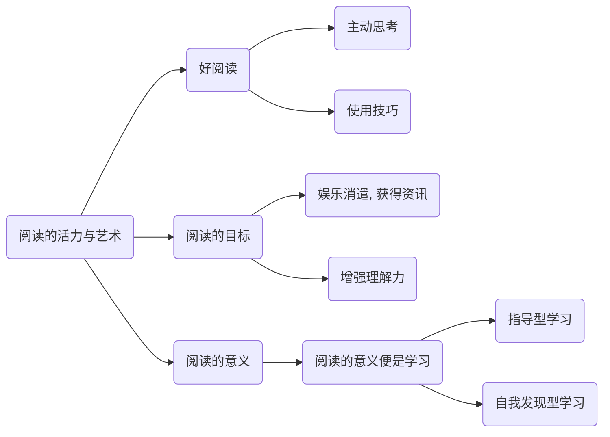

# 如何阅读一本书-第一章-阅读的活力与艺术

## 摘抄和笔记

> 我们为了“理解”(understand) 一件事，并不需要“知道”(know) 和这件事相关的所有事情。太多的资讯就如同太少的资讯一样，都是一种对理解力的阻碍。换句话说，现代的媒体正在以压倒性泛滥资讯阻碍了我们的理解力。

> 电视观众、收音机观众、杂志读者所面对的是一种复杂的组成——从独创的华丽辞藻到经过审慎挑选的资料与统计——目的都在让人不需要面对困难或努力，很容易就整理出“自己”的思绪。
>

> 但是这些（现代媒体）精美包装的资讯效率是在太高了，让观众、听众或者读者根本用不着自己做结论。相反，他们直接将包装过后的观点装进自己的脑海中，就像录影机原意接受录影带一样自然。

__现代媒体中过量的、精美包装后的资讯，会让观众和读者不断失去自我思考的能力，同时也容易影响，乃至控制观众和读者的思想。__

### 主动的阅读

> 我们是针对发展阅读书的技巧而写的。

> 虽然严格来说，比可能有完全被动阅读这回事。

> 听众或读者的“接收”，应该像是棒球赛中的捕手才对。

> 捕手的艺术就在能接住任何球的技巧——快速球、曲线求、变化球、慢速球等等。同样地，阅读的艺术也尽可能掌握住每一种资讯的技巧。

> 读者想“接住”多少意念完全看他在阅读时多么主动，以及他投入不同心思来阅读的技巧如何。

> 拿同样的书给不同的人阅读，一个人却读得比另一个人好这件事，首先在于这人的阅读更主动，其次在于他在阅读中的每一种活动都参与了更多的技巧。

__要想阅读好，“主动思考”和“使用技巧”，两者缺一不可。__

### 阅读的目标

> 只有一种方式是真正地在阅读。没有任何外力的帮助，你就是要读这本书。

> 这样我们可以粗略地为所谓的阅读艺术下个定义：这是一个凭借着脑力运作，除了玩味读物中的一些字句之外，不假任何外助，以一己之力来提升自我的过程。你的头脑会从粗浅的了解推进到深入的理解。而会产生这种结果的运作技巧，就是由许多不同活动所组合成的阅读的艺术。

> 为获得资讯而阅读，与为增进理解而阅读，其间的差异不能以道里计。

> 我们可以将“阅读”这个词，区分为两种不同的意义。第一种意义是我们在阅读报纸、杂志，或其他的东西时，凭借我们的阅读技巧与聪明才智，一下子便能融会贯通了。这样的读物能增加我们的资讯，却不能增进我们的理解力。
> 
> 第二种意义是一个人试着读某样他一开始并不怎么了解的东西，这个东西的水平就是比阅读的人高上一截。这个作者想要表达的东西，能增进阅读者的理解力。

> 当然，除了获取资讯与理解外，阅读还有一些其他的目标，就是娱乐。无论如何，本书不会谈论太多有关娱乐消遣的阅读。那是最没有要求，也不需要太多努力就能做到的事。而且那样的阅读也没有任何规则。任何人只要能阅读，想阅读，就能找一份读物来消遣。

> 重点在于，如果你想要读一本有助于增进你理解力的好书，那我们是可以帮得上忙的。如果增进理解力是你的目标，我们的主题就是阅读好书的艺术。

__阅读的目标可以分为三类，娱乐消遣、了解资讯，以及增强自身理解力。而本书的主要内容是用于介绍如何通过读“好书”，来提升自身理解力。__ 

### 阅读就是学习

> 吸收资讯是一种学习，同样地，对你以前不了解的事开始了解了，也是一种学习。但这两汇总学习当中，却有很重要的差异。

> 所谓吸收资讯，就只是知道某件事发生了。
> 
> 如果你运用的知识你的记忆力，其实你除了那些讯息之外一无所获。你并没有被启发。要能被启发，除了知道作者所说的话之外，还要明白他的意思，懂得他为什么会这么说。
> 
> 吸收资讯是要被启发的前一个动作。无论如何，重点不要止于吸收资讯而已。

> 蒙田说：“初学者的无知在于未学，而学者的无知在于学后。”
> 
> 总有一些书呆子，读的太广，却读不通。
> 
> 要避免这样的错误，以为读得多就是读得好的错误。

> 如果我们将“阅读”的含义放宽松一点，我们可以说自我发现型的学习——严格来说，非辅助型的自我发现学习——是阅读自我或世界的学习。就像指导型的学习（被教导，或者辅助型的学习）是阅读一本书，包括倾听，从讲解中学习的一种艺术。

__阅读的意义便是学习，一种是一般以娱乐消遣、了解资讯为目标的“指导型学习”，一种以增强自身理解力为目标的“自我发现型学习”。__

### 老师的出席与缺席

> 阅读却是跟着以为缺席的老师学习。

> 因此，如果我们打算继续学习与发现，我们都要懂得如何让书本教导我们。事实上，这就是本书最主要的目的。

## 总结

