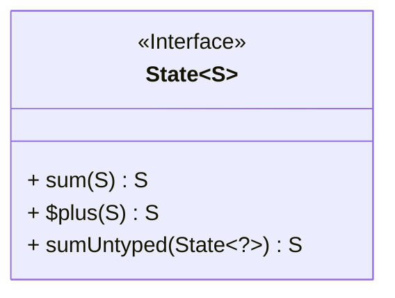
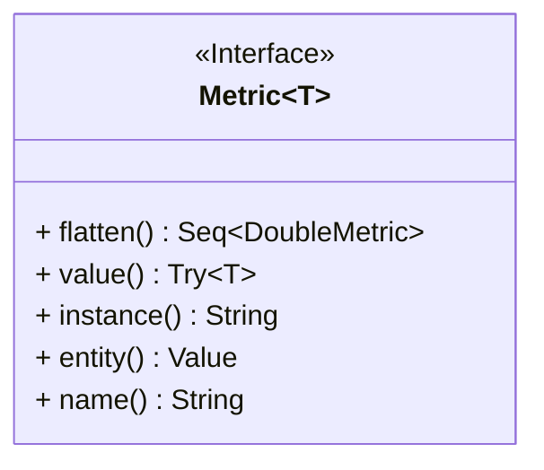
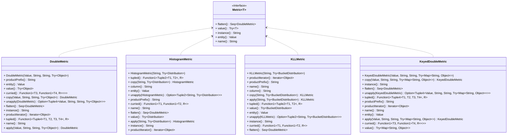
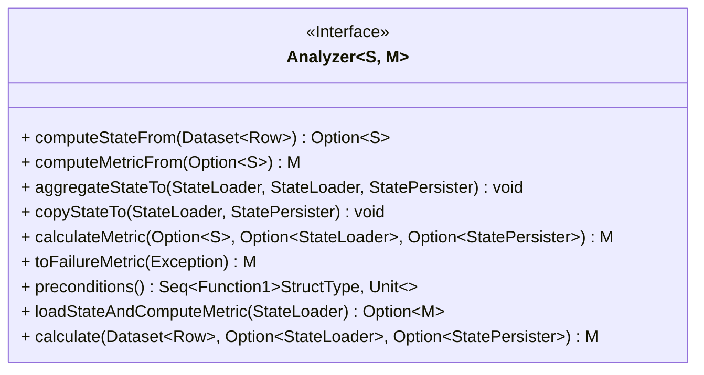
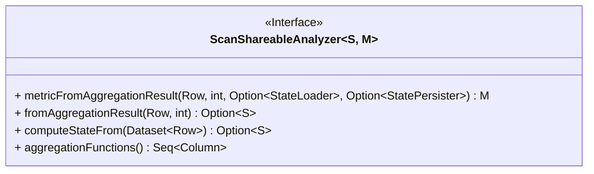
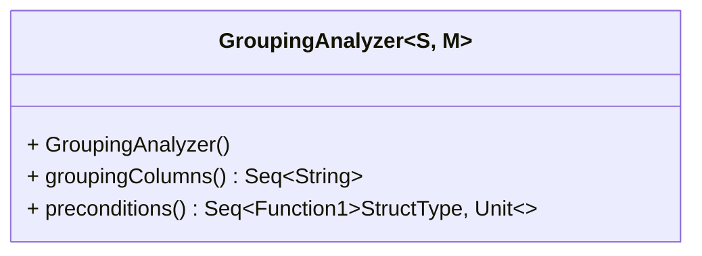
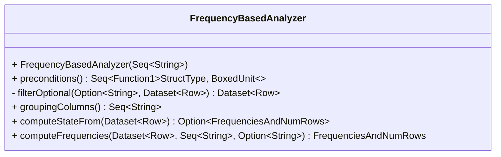

# Deequ State, Metric and Analyzer

Analyzer: Data -> State -> Metric

## 前言

本文内容基于 Deequ `1.2.2-spark-2.4` 版本。

Data: Spark DataFrame，即需要进行数据分析的具体数据集。

## State 接口



State (`com.amazon.deequ.analyzers.State`) 主要是用于保存 Analyzer 针对 DataFrame 使用 Spark 算子统计出的中间结果 (即 ` com.amazon.deequ.analyzers.Analyzer #computeStateFrom ` 方法)，State 支持同类之间相互合并，且最后都是被 Analyzer 用于加工生成对应的 Metric。

其中 State 接口只有一个需要实现的方法，即 `def sum(other: S): S`，其功能是支持与其他的 State Merge 成一个新的 State。

State 接口只定义了需要实现的功能，而 State 生成时所需的数据结构部分，则实现在了其子类中，子类的实现方式不同，其对应的数据结构也不尽相同。

// todo，增加一个继承链对应的类图

### DoubleValuedState 接口

DoubleValuedState (`com.amazon.deequ.analyzers.DoubleValuedState`) 是 State 接口的一个子接口，主要功能是在基础的 State 上新增 `def metricValue(): Double` 方法，使得 State 支持获取当前 State 中间结果中 Double 类型的 Value。

目前版本的 Deequ 中，此接口的 metricValue 方法仅应用于 `com.amazon.deequ.analyzers.StandardScanShareableAnalyzer#computeMetricFrom` 中，即用于计算和生成 DoubleMetric。

### NumMatches

NumMatches (`com.amazon.deequ.analyzers.NumMatches`) 是 DoubleValuedState 接口的一个具体实现类，以 `numMatches: Long` 的形式保存了 State。

NumMatches 是最基础的 State 之一，可以应用于各种可加性指标 Metric 的数据分析 Analyzer 运算中，如 Count、Sum 等。

```scala
case class NumMatches(numMatches: Long) extends DoubleValuedState[NumMatches] {  
  
  override def sum(other: NumMatches): NumMatches = {  
    NumMatches(numMatches + other.numMatches)  
  }  
  
  override def metricValue(): Double = {  
    numMatches.toDouble  
  }  
  
}
```

### NumMatchesAndCount

NumMatchesAndCount (`com.amazon.deequ.analyzers.NumMatchesAndCount`) 也是 DoubleValuedState 接口的一个具体实现类，相比于 NumMatches，此类 State 额外增加了 `count: Long` 属性（一般是记录当前分析的 DataFrame 总行数）。

NumMatchesAndCount 主要的功能是保存指标值 Metric Value 对应的分子和分母，适用于计算比值 Ratio 这类复合指标。

```scala
/** A state for computing ratio-based metrics,  
  * contains #rows that match a predicate and overall #rows */case class NumMatchesAndCount(numMatches: Long, count: Long)  
  extends DoubleValuedState[NumMatchesAndCount] {  
  
  override def sum(other: NumMatchesAndCount): NumMatchesAndCount = {  
    NumMatchesAndCount(numMatches + other.numMatches, count + other.count)  
  }  
  
  override def metricValue(): Double = {  
    if (count == 0L) {  
      Double.NaN  
    } else {  
      numMatches.toDouble / count  
    }  
  }  
}
```

### FrequenciesAndNumRows

```scala
/** State representing frequencies of groups in the data, as well as overall #rows */  
case class FrequenciesAndNumRows(frequencies: DataFrame, numRows: Long)  
  extends State[FrequenciesAndNumRows] {  
  
  /** Add up frequencies via an outer-join */  
  override def sum(other: FrequenciesAndNumRows): FrequenciesAndNumRows = {  
  
    val columns = frequencies.schema.fields  
      .map { _.name }  
      .filterNot { _ == COUNT_COL }  
  
    val projectionAfterMerge =  
      columns.map { column => coalesce(col(s"this.$column"), col(s"other.$column")).as(column) } ++  
        Seq((zeroIfNull(s"this.$COUNT_COL") + zeroIfNull(s"other.$COUNT_COL")).as(COUNT_COL))  
  
    /* Null-safe join condition over equality on grouping columns */  
    val joinCondition = columns.tail  
      .foldLeft(nullSafeEq(columns.head)) { case (expr, column) => expr.and(nullSafeEq(column)) }  
  
    /* Null-safe outer join to merge histograms */  
    val frequenciesSum = frequencies.alias("this")  
      .join(other.frequencies.alias("other"), joinCondition, "outer")  
      .select(projectionAfterMerge: _*)  
  
    FrequenciesAndNumRows(frequenciesSum, numRows + other.numRows)  
  }  
  
  private[analyzers] def nullSafeEq(column: String): Column = {  
    col(s"this.$column") <=> col(s"other.$column")  
  }  
  
  private[analyzers] def zeroIfNull(column: String): Column = {  
    coalesce(col(column), lit(0))  
  }  
}
```

## Metric 接口



Metric (`com.amazon.deequ.metrics.Metric`) 主要是用于保存 Analyzer 通过 State 生成的指标结果 (即 `com.amazon.deequ.analyzers.Analyzer#computeStateFrom` 方法)，此模块主要用于存放和读取已经计算完成的指标结果。

Metric 常用功能:
- `def flatten(): Seq[DoubleMetric]`:
	- 此处也侧面说明 Deequ 代码中存在类型定义和依赖混乱的问题，父类方法居然依赖子类的类型定义，子类又依赖于父类的定义，相当于循环依赖...



### DoubleMetric

FQN: com.amazon.deequ.metrics.DoubleMetric

## Analyzer 接口



Analyzer 是 Deequ 中用于加工 Data、State、Metric 三者的工具箱，每个 Analyzer 都与 Data、State、Metric 一一对应。

Analyzer 常用功能介绍：
- `def computeStateFrom(data: DataFrame): Option[S]`: 输入 Spark DataFrame，触发转换运算，获得对应的中间状态 State
- `def computeMetricFrom(state: Option[S]): M`: 输入 State，基于中间结果，生成最终的 Metric
- `def preconditions: Seq[StructType => Unit]`: 返回一组函数，用于表示执行 Analyzer 之前对应的 DataFrame 的数据结构 Schema 需要满足的一系列前提条件
- `def calculate(data: DataFrame, aggregateWith: Option[StateLoader] = None, saveStatesWith: Option[StatePersister] = None): M`: 调用 preconditions、computeStateFrom、computeMetricFrom，用于生成对应的 Metric

```mermaid

classDiagram
direction BT
class Analyzer~S, M~ {

<<Interface>>

  + loadStateAndComputeMetric(StateLoader) Option~M~

  + aggregateStateTo(StateLoader, StateLoader, StatePersister) void

  + computeMetricFrom(Option~S~) M

  + preconditions() Seq~Function1~StructType, Unit~~

  + calculate(Dataset~Row~, Option~StateLoader~, Option~StatePersister~) M

  + calculateMetric(Option~S~, Option~StateLoader~, Option~StatePersister~) M

  + toFailureMetric(Exception) M

  + computeStateFrom(Dataset~Row~) Option~S~

  + copyStateTo(StateLoader, StatePersister) void

}

class ApproxQuantile {

  + ApproxQuantile(String, double, double, Option~String~)

  + aggregationFunctions() List~Column~

  + aggregateStateTo(StateLoader, StateLoader, StatePersister) void

  + copyStateTo(StateLoader, StatePersister) void

  + PARAM_CHECKS() Function1~StructType, Unit~

  + unapply(ApproxQuantile) Option~Tuple4~String, Object, Object, Option~String~~~

  + apply(String, double, double, Option~String~) ApproxQuantile

  + copy(String, double, double, Option~String~) ApproxQuantile

  + where() Option~String~

  + calculateMetric(Option~ApproxQuantileState~, Option~StateLoader~, Option~StatePersister~) DoubleMetric

  + column() String

  + computeMetricFrom(Option~ApproxQuantileState~) DoubleMetric

  + quantile() double

  + filterCondition() Option~String~

  + fromAggregationResult(Row, int) Option~ApproxQuantileState~

  + metricFromAggregationResult(Row, int, Option~StateLoader~, Option~StatePersister~) DoubleMetric

  + loadStateAndComputeMetric(StateLoader) Option~DoubleMetric~

  + preconditions() Seq~Function1~StructType, Unit~~

  + relativeError() double

  + productPrefix() String

  + calculate(Dataset~Row~, Option~StateLoader~, Option~StatePersister~) DoubleMetric

  + toFailureMetric(Exception) DoubleMetric

  + productIterator() Iterator~Object~

  + curried() Function1~T1, Function1~T2, Function1~T3, Function1~T4, R~~~~

  + tupled() Function1~Tuple4~T1, T2, T3, T4~, R~

  + computeStateFrom(Dataset~Row~) Option~ApproxQuantileState~

}

class GroupingAnalyzer~S, M~ {

  + GroupingAnalyzer()

  + loadStateAndComputeMetric(StateLoader) Option~M~

  + aggregateStateTo(StateLoader, StateLoader, StatePersister) void

  + calculate(Dataset~Row~, Option~StateLoader~, Option~StatePersister~) M

  + groupingColumns() Seq~String~

  + calculateMetric(Option~S~, Option~StateLoader~, Option~StatePersister~) M

  + preconditions() Seq~Function1~StructType, Unit~~

  + copyStateTo(StateLoader, StatePersister) void

}

class KLLSketch {

  + KLLSketch(String, Option~KLLParameters~)

  + sketchSize() int

  + productIterator() Iterator~Object~

  + shrinkingFactor_$eq(double) void

  + column() String

  + copy(String, Option~KLLParameters~) KLLSketch

  + DEFAULT_SKETCH_SIZE() int

  + calculate(Dataset~Row~, Option~StateLoader~, Option~StatePersister~) KLLMetric

  - PARAM_CHECK() Function1~StructType, Unit~

  + kllParameters() Option~KLLParameters~

  + aggregationFunctions() Seq~Column~

  + preconditions() Seq~Function1~StructType, Unit~~

  + calculateMetric(Option~KLLState~, Option~StateLoader~, Option~StatePersister~) KLLMetric

  + numberOfBuckets() int

  + DEFAULT_SHRINKING_FACTOR() double

  + productPrefix() String

  + unapply(KLLSketch) Option~Tuple2~String, Option~KLLParameters~~~

  + toFailureMetric(Exception) KLLMetric

  + numberOfBuckets_$eq(int) void

  + shrinkingFactor() double

  + sketchSize_$eq(int) void

  + fromAggregationResult(Row, int) Option~KLLState~

  + computeMetricFrom(Option~KLLState~) KLLMetric

  + MAXIMUM_ALLOWED_DETAIL_BINS() int

  + metricFromAggregationResult(Row, int, Option~StateLoader~, Option~StatePersister~) KLLMetric

  + computeStateFrom(Dataset~Row~) Option~KLLState~

  + aggregateStateTo(StateLoader, StateLoader, StatePersister) void

  + loadStateAndComputeMetric(StateLoader) Option~KLLMetric~

  + apply(String, Option~KLLParameters~) KLLSketch

  + copyStateTo(StateLoader, StatePersister) void

}

class SampleAnalyzer {

  + SampleAnalyzer(String)

  + loadStateAndComputeMetric(StateLoader) Option~DoubleMetric~

  + apply(String) SampleAnalyzer

  + column() String

  + computeStateFrom(Dataset~Row~) Option~NumMatches~

  + copy(String) SampleAnalyzer

  + compose(Function1~A, T1~) Function1~A, R~

  + productIterator() Iterator~Object~

  + toFailureMetric(Exception) DoubleMetric

  + andThen(Function1~R, A~) Function1~T1, A~

  + preconditions() Seq~Function1~StructType, Unit~~

  + unapply(SampleAnalyzer) Option~String~

  + calculate(Dataset~Row~, Option~StateLoader~, Option~StatePersister~) DoubleMetric

  + computeMetricFrom(Option~NumMatches~) DoubleMetric

  + aggregateStateTo(StateLoader, StateLoader, StatePersister) void

  + copyStateTo(StateLoader, StatePersister) void

  + calculateMetric(Option~NumMatches~, Option~StateLoader~, Option~StatePersister~) DoubleMetric

  + productPrefix() String

}

class ScanShareableAnalyzer~S, M~ {

<<Interface>>

  + metricFromAggregationResult(Row, int, Option~StateLoader~, Option~StatePersister~) M

  + fromAggregationResult(Row, int) Option~S~

  + computeStateFrom(Dataset~Row~) Option~S~

  + aggregationFunctions() Seq~Column~

}

class StandardScanShareableAnalyzer~S~ {

  + StandardScanShareableAnalyzer(String, String, Value)

  + metricFromAggregationResult(Row, int, Option~StateLoader~, Option~StatePersister~) DoubleMetric

  + loadStateAndComputeMetric(StateLoader) Option~DoubleMetric~

  + additionalPreconditions() Seq~Function1~StructType, Unit~~

  + calculateMetric(Option~S~, Option~StateLoader~, Option~StatePersister~) DoubleMetric

  + preconditions() Seq~Function1~StructType, Unit~~

  + computeMetricFrom(Option~S~) DoubleMetric

  + copyStateTo(StateLoader, StatePersister) void

  + toFailureMetric(Exception) DoubleMetric

  + aggregateStateTo(StateLoader, StateLoader, StatePersister) void

  + computeStateFrom(Dataset~Row~) Option~S~

  + calculate(Dataset~Row~, Option~StateLoader~, Option~StatePersister~) DoubleMetric

}

ApproxQuantile  ..>  ScanShareableAnalyzer~S, M~
GroupingAnalyzer~S, M~  ..>  Analyzer~S, M~
KLLSketch  ..>  ScanShareableAnalyzer~S, M~
SampleAnalyzer  ..>  Analyzer~S, M~
ScanShareableAnalyzer~S, M~  -->  Analyzer~S, M~
StandardScanShareableAnalyzer~S~  ..>  ScanShareableAnalyzer~S, M~
```



### ScanShareableAnalyzer 接口



ScanShareableAnalyzer 常用功能介绍:
- `def aggregationFunctions(): Seq[Column]`: 返回一组 Column，其中 Column 对象是针对 DataFrame 的列聚合运算的定义（如：sum、max 等）
- `def fromAggregationResult(result: Row, offset: Int): Option[S]`
- `def computeStateFrom(data: DataFrame): Option[S]`: 通过 aggregationFunctions 方法返回的聚合运算表达式，针对 Data 进行聚合运算，并将生成的结果的首行 Row 作为 Result 传入 fromAggregationResult 方法，进而生成对应的 State
	- 注意： ScanShareableAnalyzer 默认针对 Data 进行聚合运算的结果默认只取一行，是因为此类 Analyzer 默认针对数据集的运算只会返回一条结果，即聚合粒度是整个数据集
	- 此处不得不再吐槽一下，这里接口的设计得有点太窄了，对于后续 State 的计算不够灵活

### GroupingAnalyzer



`def groupingColumns(): Seq[String]`: 返回当前 GroupingAnalyzer 的分组列名

### FrequencyBasedAnalyzer



FrequencyBasedAnalyzer 中引入了 State FrequenciesAndNumRows，进而支持保存 GroupBy+Count 算子运算后的 DataFrame (此时的 DataFrame 可以类比为一种 Map 结构，Key 为 GroupBy 的列，Value 为对应的 Count 计数) 作为中间结果。

其中 FrequenciesAndNumRows 主要用于保存 Frequencies (运算的中间结果) 和 NumRows (原始数据集 DataFrame 的行记录数)，便于后续两者结合

FrequencyBasedAnalyzer 常用功能介绍：

- `def computeFrequencies(data: DataFrame,  groupingColumns: Seq[String],  where: Option[String] = None)  : FrequenciesAndNumRows`:

## 参考链接

1. [GitHub - awslabs/deequ at release/1.2.2-spark-2.4](https://github.com/awslabs/deequ/tree/release/1.2.2-spark-2.4)