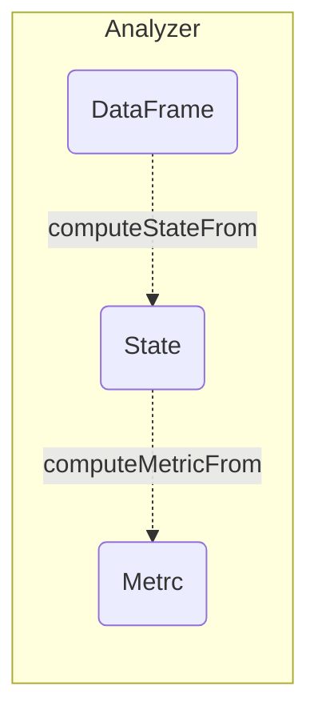
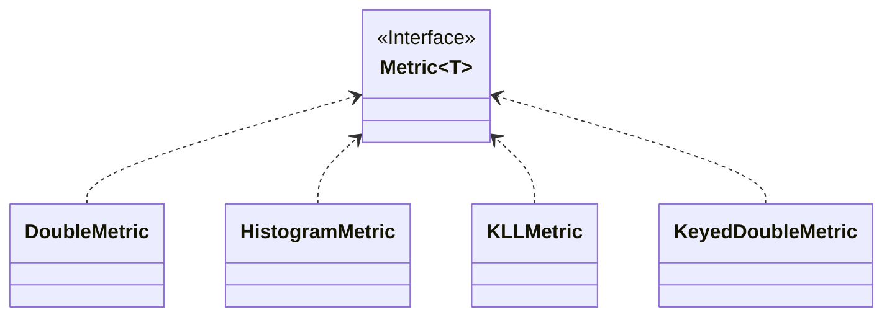
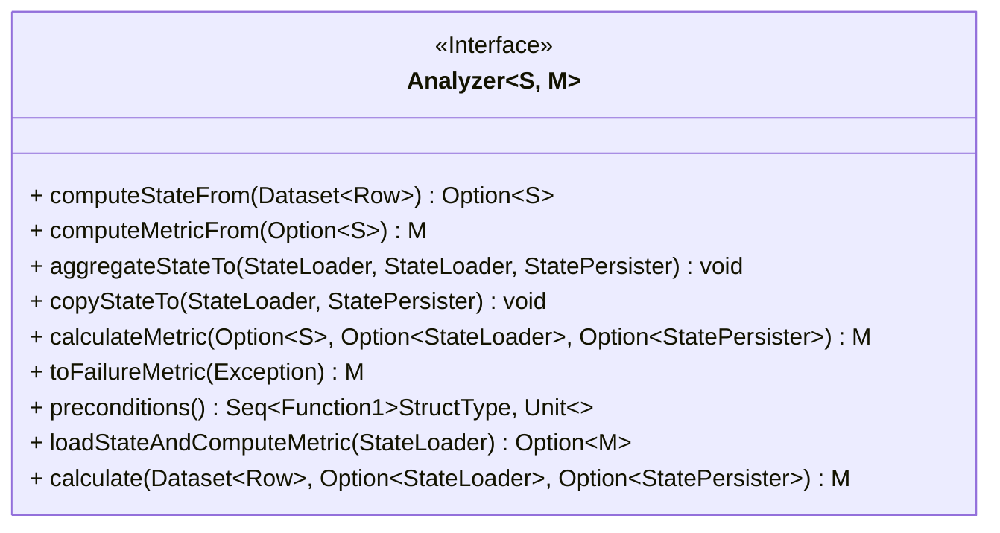
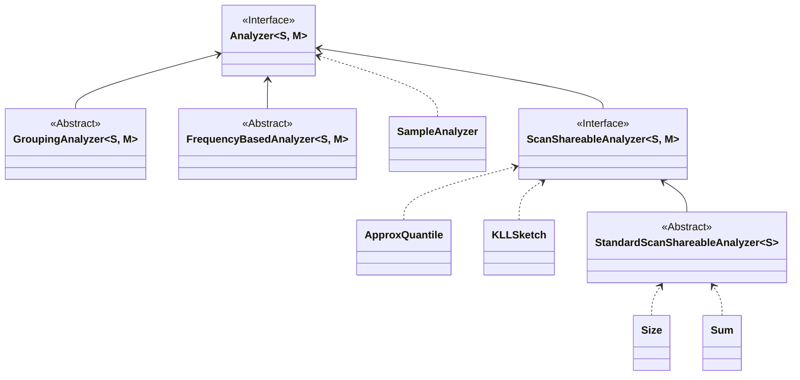
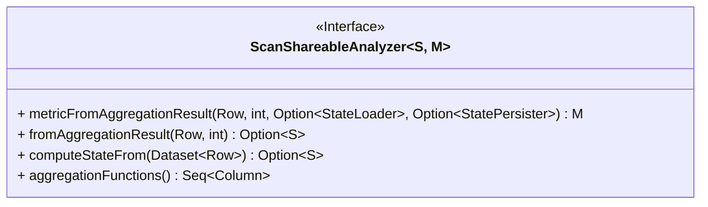
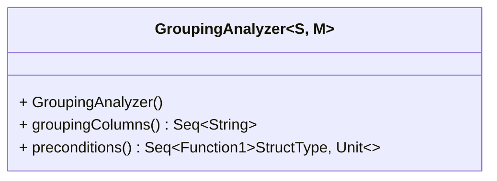
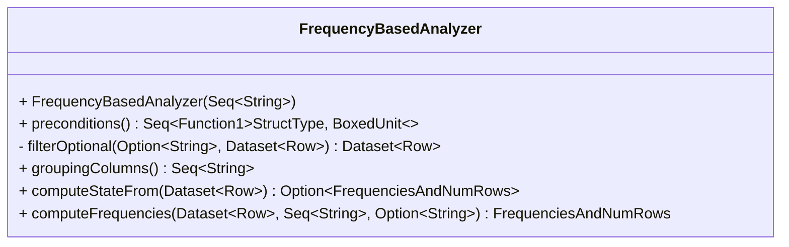

# Deequ State, Metric and Analyzer

## 概览

本文内容基于 Deequ `1.2.2-spark-2.4` 版本。

Data:
- Spark DataFrame，即需要 Analyzer 进行数据分析的具体数据集。

State:
- Analyzer 针对具体数据集 Data 进行聚合运算后生成的中间运算结果，同类 State 之间支持合并，生成 State 的阶段是每个分析过程的主要运算阶段。

Metric:
- Analyzer 基于中间结果 State 生成的最终结果 Metric。相比于承担聚合运算的 State，Metric 的职责更多的是针对数据分析结果的一种整合，通常只是一些简单的数学运算。

Analyzer:
- Analyzer 是 Deequ 中用于加工 Data、State、Metric 三者的标准工具箱，每个 Analyzer 都与 Data、State、Metric 三者一一对应。相当于 Data、State、Metric 三者是“食材”，而 Analyzer 则承担着“厨具”的职责。



## State 接口

在 Deequ 中，State (`com.amazon.deequ.analyzers.State`) 主要是用于保存 Analyzer 针对 DataFrame 使用 Spark 算子统计出的中间结果 (即 ` com.amazon.deequ.analyzers.Analyzer #computeStateFrom ` 方法)，State 支持同类之间相互合并，且最后都是被 Analyzer 用于加工生成对应的 Metric。

```scala
/**  
  * A state (sufficient statistic) computed from data, from which we can compute a metric.  * Must be combinable with other states of the same type  * (= algebraic properties of a commutative semi-group)  */trait State[S <: State[S]] {  
  
  // Unfortunately this is required due to type checking issues  
  private[analyzers] def sumUntyped(other: State[_]): S = {  
    sum(other.asInstanceOf[S])  
  }  
  
  /** Combine this with another state */  
  def sum(other: S): S  
  
  /** Same as sum, syntatic sugar */  
  def +(other: S): S = {  
    sum(other)  
  }  
}
```

其中 State 接口只有一个需要实现的方法，即 `def sum(other: S): S`，其功能是支持与其他的 State Merge 成一个新的 State。

State 接口只定义了需要实现的功能，而 State 生成时所需的数据结构部分，则实现在了其子类中，子类的实现方式不同，其对应的数据结构也不尽相同。

// todo，增加一个继承链对应的类图，概要版

### DoubleValuedState 接口

DoubleValuedState (`com.amazon.deequ.analyzers.DoubleValuedState`) 是 State 接口的一个子接口，主要功能是在基础的 State 上新增 `def metricValue(): Double` 方法，使得 State 支持获取当前 State 中间结果中 Double 类型的 Value。

目前版本的 Deequ 中，此接口的 metricValue 方法仅应用于 `com.amazon.deequ.analyzers.StandardScanShareableAnalyzer#computeMetricFrom` 中，即用于计算和生成 DoubleMetric。

### NumMatches 类

NumMatches (`com.amazon.deequ.analyzers.NumMatches`) 是 DoubleValuedState 接口的一个具体实现类，以 `numMatches: Long` 的形式保存了 State。

NumMatches 是最基础的 State 之一，可以应用于各种可加性指标 Metric 的数据分析 Analyzer 运算中，如 Count、Sum 等。

```scala
case class NumMatches(numMatches: Long) extends DoubleValuedState[NumMatches] {  
  
  override def sum(other: NumMatches): NumMatches = {  
    NumMatches(numMatches + other.numMatches)  
  }  
  
  override def metricValue(): Double = {  
    numMatches.toDouble  
  }  
  
}
```

### NumMatchesAndCount 类

NumMatchesAndCount (`com.amazon.deequ.analyzers.NumMatchesAndCount`) 也是 DoubleValuedState 接口的一个具体实现类，相比于 NumMatches，此类 State 额外增加了 `count: Long` 属性（一般是记录当前分析的 DataFrame 总行数）。

NumMatchesAndCount 主要的功能是保存指标值 Metric Value 对应的分子和分母，适用于计算比值 Ratio 这类复合指标。

```scala
/** A state for computing ratio-based metrics,  
  * contains #rows that match a predicate and overall #rows */case class NumMatchesAndCount(numMatches: Long, count: Long)  
  extends DoubleValuedState[NumMatchesAndCount] {  
  
  override def sum(other: NumMatchesAndCount): NumMatchesAndCount = {  
    NumMatchesAndCount(numMatches + other.numMatches, count + other.count)  
  }  
  
  override def metricValue(): Double = {  
    if (count == 0L) {  
      Double.NaN  
    } else {  
      numMatches.toDouble / count  
    }  
  }  
}
```

### FrequenciesAndNumRows 类

```scala
/** State representing frequencies of groups in the data, as well as overall #rows */  
case class FrequenciesAndNumRows(frequencies: DataFrame, numRows: Long)  
  extends State[FrequenciesAndNumRows] {  
  
  /** Add up frequencies via an outer-join */  
  override def sum(other: FrequenciesAndNumRows): FrequenciesAndNumRows = {  
  
    val columns = frequencies.schema.fields  
      .map { _.name }  
      .filterNot { _ == COUNT_COL }  
  
    val projectionAfterMerge =  
      columns.map { column => coalesce(col(s"this.$column"), col(s"other.$column")).as(column) } ++  
        Seq((zeroIfNull(s"this.$COUNT_COL") + zeroIfNull(s"other.$COUNT_COL")).as(COUNT_COL))  
  
    /* Null-safe join condition over equality on grouping columns */  
    val joinCondition = columns.tail  
      .foldLeft(nullSafeEq(columns.head)) { case (expr, column) => expr.and(nullSafeEq(column)) }  
  
    /* Null-safe outer join to merge histograms */  
    val frequenciesSum = frequencies.alias("this")  
      .join(other.frequencies.alias("other"), joinCondition, "outer")  
      .select(projectionAfterMerge: _*)  
  
    FrequenciesAndNumRows(frequenciesSum, numRows + other.numRows)  
  }  
  
  private[analyzers] def nullSafeEq(column: String): Column = {  
    col(s"this.$column") <=> col(s"other.$column")  
  }  
  
  private[analyzers] def zeroIfNull(column: String): Column = {  
    coalesce(col(column), lit(0))  
  }  
}
```

## Metric 接口

Metric 主要是用于保存 Analyzer 通过 State 生成的指标结果 (此过程主要实现在 `com.amazon.deequ.analyzers.Analyzer#computeStateFrom` 方法)，主要用于存放和读取已经计算完成的指标结果。



**com.amazon.deequ.metrics.Metric 源码**:

```scala
/** Common trait for all data quality metrics */
trait Metric[T] {
  val entity: Entity.Value
  val instance: String
  val name: String
  val value: Try[T]

  /*
   * Composite metric objects e.g histogram can implement this method to
   * returned flattened view of the internal values in terms of double metrics.
   * @see HistogramMetric for sample
   */
  def flatten(): Seq[DoubleMetric]
}
```

**Metric 主要结构和功能**:

- `entity`: Metric 指标对应的聚合运算粒度，此字段类型是枚举值，目前有 DataSet、Column、Mutlicolumn 三种，分别对应按整个数据集聚合、按照指定列聚合、按照多个列聚合。
- `instance`: Metric 分析的实例名称，如：某个字段名。
- `name`: Metric 对应的名称。
- `value`: Metric 对应的 Value，即本次运算分析的最终结果。
- `flatten(): Seq[DoubleMetric]`:
	- 返回扁平化处理后的 Metrics，主要用于简化某些嵌套类的 Metric，便于后续统一数据结构和序列化等操作
	- 方法签名中的 DoubleMetric 也侧面说明 Deequ 代码中存在类型定义和依赖混乱的问题，父类方法居然依赖子类的类型定义，子类又依赖于父类的定义，即循环依赖...

### DoubleMetric 类

**com.amazon.deequ.metrics.DoubleMetric 源码**:

```scala
/** Common trait for all data quality metrics where the value is double */
case class DoubleMetric(
    entity: Entity.Value,
    name: String,
    instance: String,
    value: Try[Double])
  extends Metric[Double] {

  override def flatten(): Seq[DoubleMetric] = Seq(this)
}
```

### KeyedDoubleMetric 类

**com.amazon.deequ.metrics.KeyedDoubleMetric 源码**:

```scala
case class KeyedDoubleMetric(
    entity: Entity.Value,
    name: String,
    instance: String,
    value: Try[Map[String, Double]])
  extends Metric[Map[String, Double]] {

  override def flatten(): Seq[DoubleMetric] = {
    if (value.isSuccess) {
      value.get.map { case (key, correspondingValue) =>
        DoubleMetric(entity, s"$name-$key", instance, Success(correspondingValue))
      }
      .toSeq
    } else {
      Seq(DoubleMetric(entity, s"$name", instance, Failure(value.failed.get)))
    }
  }
}
```

## Analyzer 接口



Analyzer 是 Deequ 中用于加工 Data、State、Metric 三者的工具箱，每个 Analyzer 都与 Data、State、Metric 一一对应。

Analyzer 常用功能介绍：
- `def computeStateFrom(data: DataFrame): Option[S]`: 输入 Spark DataFrame，触发转换运算，获得对应的中间状态 State
- `def computeMetricFrom(state: Option[S]): M`: 输入 State，基于中间结果，生成最终的 Metric
- `def preconditions: Seq[StructType => Unit]`: 返回一组函数，用于表示执行 Analyzer 之前对应的 DataFrame 的数据结构 Schema 需要满足的一系列前提条件
- `def calculate(data: DataFrame, aggregateWith: Option[StateLoader] = None, saveStatesWith: Option[StatePersister] = None): M`: 调用 preconditions、computeStateFrom、computeMetricFrom，用于生成对应的 Metric



### ScanShareableAnalyzer 接口



**ScanShareableAnalyzer 接口常用功能介绍:**

- `def aggregationFunctions(): Seq[Column]`: 返回一组 Column，其中 Column 对象是针对 DataFrame 的列聚合运算的定义（如：sum、max 等）
- `def fromAggregationResult(result: Row, offset: Int): Option[S]`
- `def computeStateFrom(data: DataFrame): Option[S]`: 通过 aggregationFunctions 方法返回的聚合运算表达式，针对 Data 进行聚合运算，并将生成的结果的首行 Row 作为 Result 传入 fromAggregationResult 方法，进而生成对应的 State
	- 注意： ScanShareableAnalyzer 默认针对 Data 进行聚合运算的结果默认只取一行，是因为此类 Analyzer 默认针对数据集的运算只会返回一条结果，即聚合粒度是整个数据集
	- 此处不得不再吐槽一下，这里接口的设计得有点太窄了，对于后续 State 的计算不够灵活

**com.amazon.deequ.analyzers.ScanShareableAnalyzer 源码:**

```scala
/** An analyzer that runs a set of aggregation functions over the data,  
  * can share scans over the data */trait ScanShareableAnalyzer[S <: State[_], +M <: Metric[_]] extends Analyzer[S, M] {  
  
  /** Defines the aggregations to compute on the data */  
  private[deequ] def aggregationFunctions(): Seq[Column]  
  
  /** Computes the state from the result of the aggregation functions */  
  private[deequ] def fromAggregationResult(result: Row, offset: Int): Option[S]  
  
  /** Runs aggregation functions directly, without scan sharing */  
  override def computeStateFrom(data: DataFrame): Option[S] = {  
    val aggregations = aggregationFunctions()  
    val result = data.agg(aggregations.head, aggregations.tail: _*).collect().head  
    fromAggregationResult(result, 0)  
  }  
  
  /** Produces a metric from the aggregation result */  
  private[deequ] def metricFromAggregationResult(  
      result: Row,  
      offset: Int,  
      aggregateWith: Option[StateLoader] = None,  
      saveStatesWith: Option[StatePersister] = None)  
    : M = {  
  
    val state = fromAggregationResult(result, offset)  
  
    calculateMetric(state, aggregateWith, saveStatesWith)  
  }  
  
}
```

### GroupingAnalyzer 抽象类



**GroupingAnalyzer 常用功能介绍：**

- `def groupingColumns(): Seq[String]`: 返回当前 GroupingAnalyzer 的分组列名

### FrequencyBasedAnalyzer 抽象类



FrequencyBasedAnalyzer 中引入了 State FrequenciesAndNumRows，进而支持保存 GroupBy+Count 算子运算后的 DataFrame (此时的 DataFrame 可以类比为一种 Map 结构，Key 为 GroupBy 的列，Value 为对应的 Count 计数) 作为中间结果。

其中 FrequenciesAndNumRows 主要用于保存 Frequencies (运算的中间结果) 和 NumRows (原始数据集 DataFrame 的行记录数)，便于后续两者结合

**FrequencyBasedAnalyzer 常用功能介绍：**
- `computeFrequencies(data: DataFrame, groupingColumns: Seq[String], where: Option[String] = None): FrequenciesAndNumRows`:

**com.amazon.deequ.analyzers.FrequencyBasedAnalyzer 源码:**

```scala
/** Base class for all analyzers that operate the frequencies of groups in the data */
abstract class FrequencyBasedAnalyzer(columnsToGroupOn: Seq[String])
  extends GroupingAnalyzer[FrequenciesAndNumRows, DoubleMetric] {

  override def groupingColumns(): Seq[String] = { columnsToGroupOn }

  override def computeStateFrom(data: DataFrame): Option[FrequenciesAndNumRows] = {
    Some(FrequencyBasedAnalyzer.computeFrequencies(data, groupingColumns()))
  }

  /** We need at least one grouping column, and all specified columns must exist */
  override def preconditions: Seq[StructType => Unit] = {
    Seq(atLeastOne(columnsToGroupOn)) ++ columnsToGroupOn.map { hasColumn } ++
      columnsToGroupOn.map { isNotNested } ++ super.preconditions
  }
}

object FrequencyBasedAnalyzer {

  /** Compute the frequencies of groups in the data, essentially via a query like
    *
    * SELECT colA, colB, ..., COUNT(*)
    * FROM DATA
    * WHERE colA IS NOT NULL OR colB IS NOT NULL OR ...
    * GROUP BY colA, colB, ...
    */
  def computeFrequencies(
      data: DataFrame,
      groupingColumns: Seq[String],
      where: Option[String] = None)
    : FrequenciesAndNumRows = {

    val columnsToGroupBy = groupingColumns.map { name => col(name) }.toArray
    val projectionColumns = columnsToGroupBy :+ col(COUNT_COL)

    val atLeastOneNonNullGroupingColumn = groupingColumns
      .foldLeft(expr(false.toString)) { case (condition, name) =>
        condition.or(col(name).isNotNull)
      }

    val frequencies = data
      .select(columnsToGroupBy: _*)
      .where(atLeastOneNonNullGroupingColumn)
      .transform(filterOptional(where))
      .groupBy(columnsToGroupBy: _*)
      .agg(count(lit(1)).alias(COUNT_COL))
      .select(projectionColumns: _*)

    val numRows = data
      .select(columnsToGroupBy: _*)
      .where(atLeastOneNonNullGroupingColumn)
      .transform(filterOptional(where))
      .count()

    FrequenciesAndNumRows(frequencies, numRows)
  }

  private def filterOptional(where: Option[String])(data: DataFrame) : DataFrame = {
    where match {
      case Some(condition) => data.filter(condition)
      case _ => data
    }
  }
}
```

## 参考链接

1. [GitHub - awslabs/deequ at release/1.2.2-spark-2.4](https://github.com/awslabs/deequ/tree/release/1.2.2-spark-2.4)