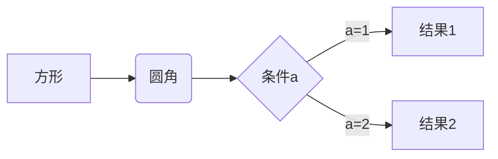
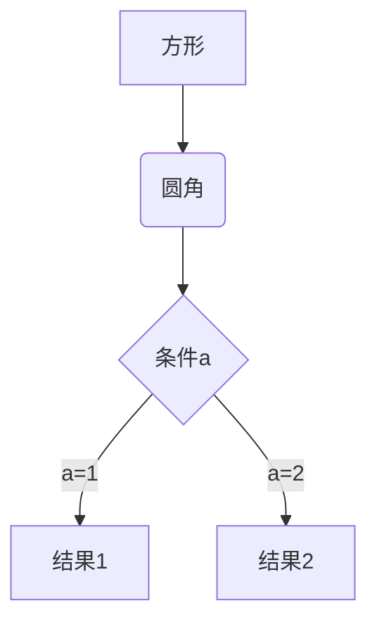
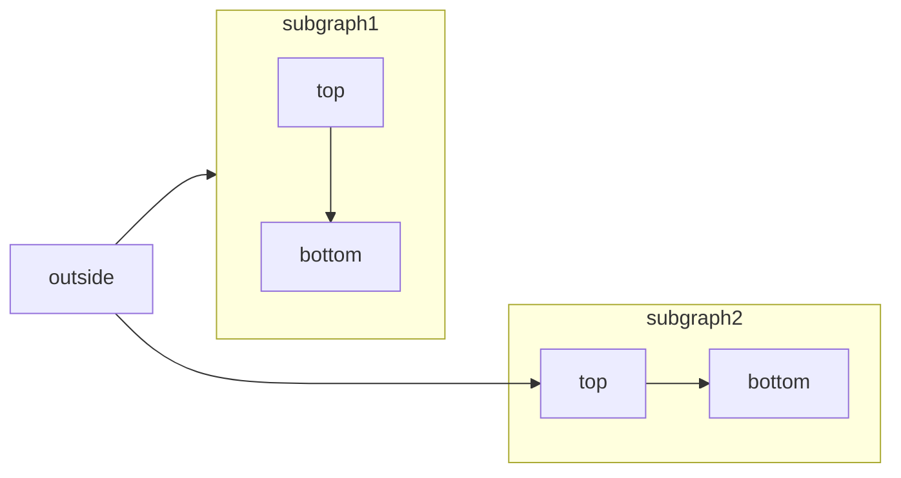
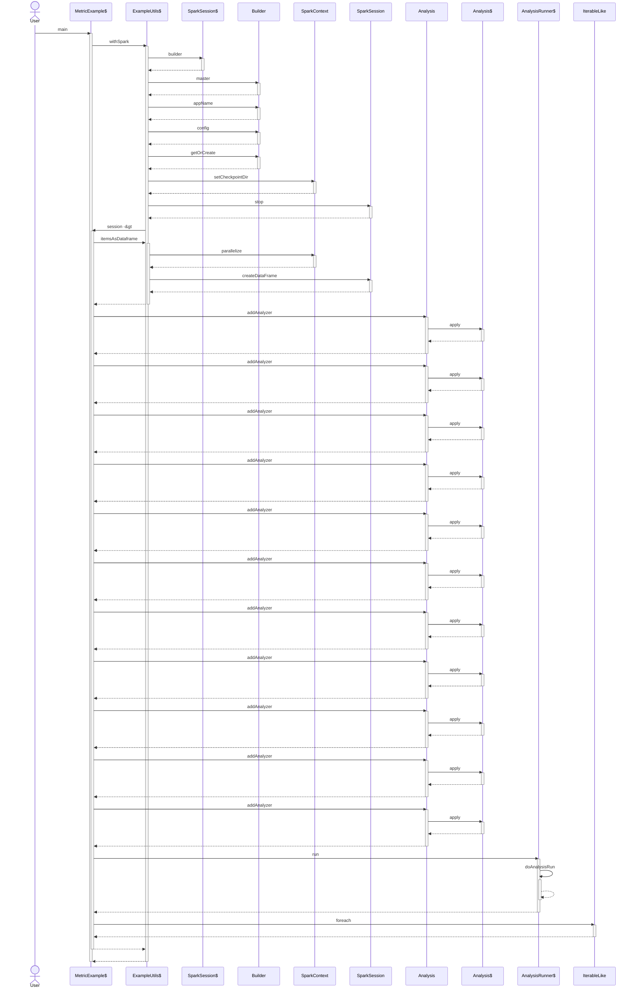
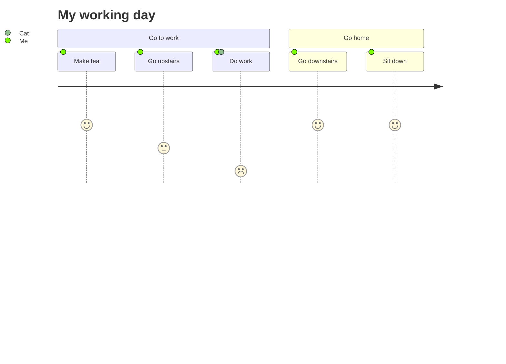
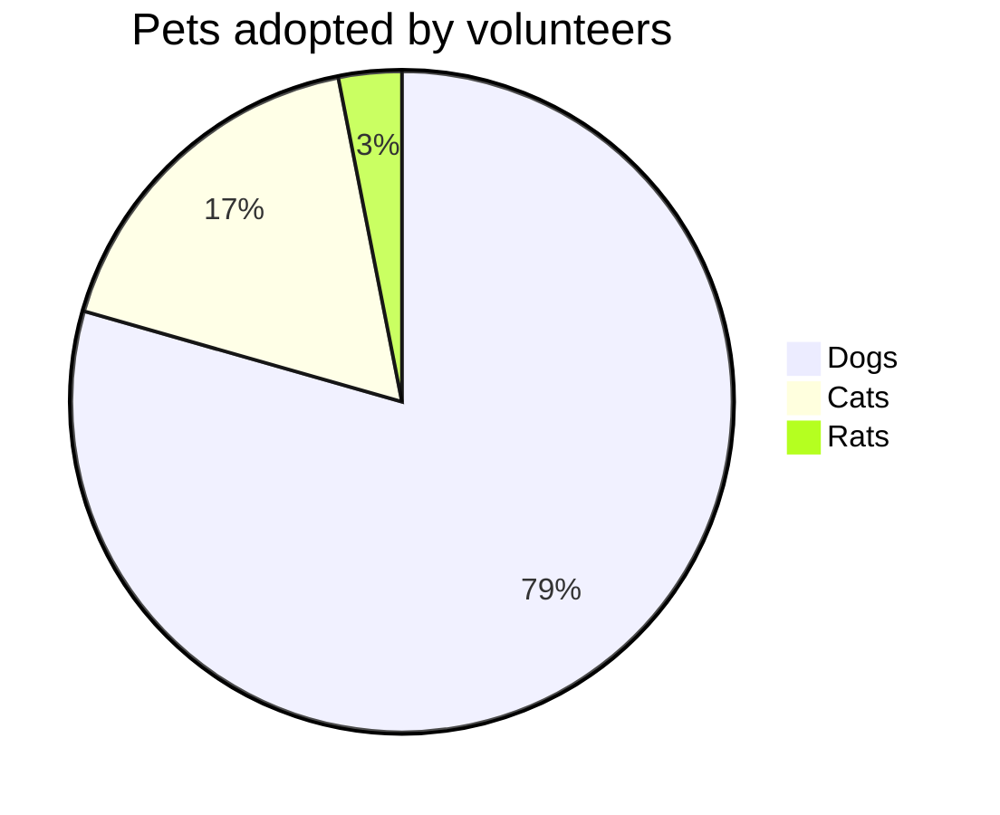
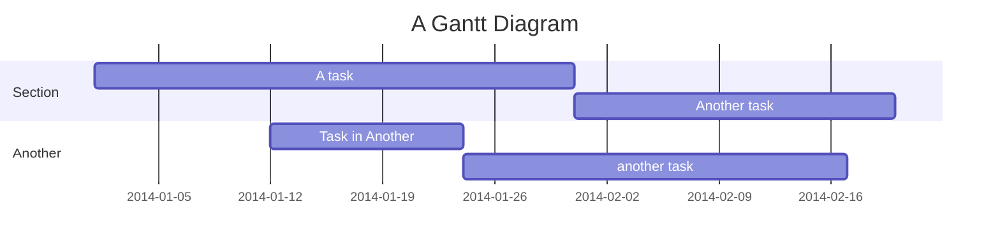

# Mermaid 基础教程

## 简介

Mermaid 是一个开源的 JavaScript 库，用于绘制流程图、时序图、类图和其他各种图表。它使用简洁的文本语法来描述图表结构，并将其转换为可视化图形。Mermaid 可以直接嵌入到 Markdown 文档、网页或其他文档中，以创建可交互和易于阅读的图表。

但 Mermaid 能够支持的 UML 图形有限，只能支持一些常用的 UML 图形，如果想要自由使用所有的 UML 图形，还是需要使用 PlantUML 这类专业绘图工具。

这类通过代码自动生成图形的工具，其特点都是无法自行控制流程细节，适合简单的标准图形，不适合复杂图形。

Documentation
https://github.com/mermaid-js/mermaid
https://mermaid.js.org/intro/

Online Demo
https://mermaid.live/

## 常用图例

### 流程图

从左到右

从上至下

subgraph

### 序列图

### 用户旅程图

User Journey Diagram

### 饼图
Pie Chart

### 甘特图

