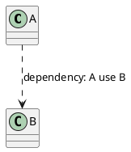
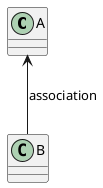
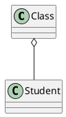
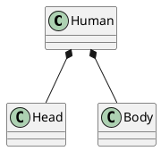
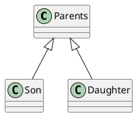
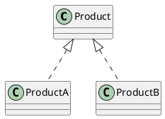
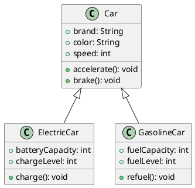

# UML(统一建模语言)基础教程

## UML 概述

UML（Unified Modeling Language，统一建模语言）是由对象管理组织（Object Management Group, OMG）制定的一个通用的、可视化的建模语言标准，可以用来描述、可视化、构造和文档化（specifying, visualizing, constructing, and documenting）软件密集型系统的各种工件，并且已被 ISO 确立为国际标准。

**UML（统一建模语言）最初确实是为面向对象方法设计的，但它并不仅限于面向对象建模**。UML 可以用于描述和表示各种类型的系统和问题领域，不仅局限于面向对象的软件分析和设计。

目前最新版本的 UML 名为 UML2。

### UML 概念模型

UML 概念模型主要包含三个部分：
1. 事物（Things）
2. 关系（Relationship）
3. UML 图（Diagrams）

### UML 适用和不适用的场景

**使用场景**：
1. 项目采用了 Object-Oriented 的方法论
2. 问题复杂，需要更加抽象的方式来概括描述，抓住问题本质，同时提高交流效率
3. 方案需要归档，已便后续复用，减少重复开发成本

**不适用场景**：
1. OO 技术使用很少，项目中现有的方式已经完全适用
2. 需求实现难度低，文字描述就可以阐述清楚

### OO 基本概念

[面向对象的基本概念](work/methodology/SoftwareEngineering/Analysis-and-Design/Object-Oriented-Design/面向对象的基本概念.md)

## UML Things（事物）

结构事物（Structural Thing）：UML模型中的名词

行为事物（Behavioral Thing）：UML模型中的动词

分组事物（Grouping Thing）：UML模型中的组织

注释事物（Annotational Thing）：UML模型的解释部分

## UML Relationship (关系)

### 依赖（Dependency）
若 A 使用了 B，则表明 A 依赖于 B。

### 关联（Association）

关联（Association）是一种强语义联系的结构关系，表名两个事物之间存在明确的、稳定的语义联系。聚合（Aggregation）和组合（Combination）是两种不同类型的关联关系。

在关联关系的图形符号中，可以使用实线+箭头，也可以不使用箭头，单独使用实线，默认也视为关联关系，不过是双向关联。

#### 关联关系-聚合（Aggregation）
即Has-a 的关系

#### 关联关系-组合（Combination）
即 contains-a 的关系

### 泛化（Generalization）
即继承（extend）

### 实现（Realization）

## UML Diagrams（图）

建议参考《UML2 面向对象分析与设计（第 2 版）》，2.5 应用 UML2 建模

### 结构图（Structural Diagrams）

#### 包图（Package Diagrams）

#### 类图（Class or Structural Diagrams）

#### 对象图（Object Diagrams）

#### 组合结构图（Composite Structure Diagrams）

#### 组件图（Component Diagrams）

#### 部署图（Deployment Diagrams）

### 行为图（Behavioral Diagrams）

#### 用例图（Use Case Diagrams）

作用：用于描述 Actor 和 System 中的 Use Case 之间的联系，常用于业务分析和需求分析阶段。

组成元素：参与者（Actor）、用例（Use Case）、关系（Relationship）、系统（System）。

关系：关联（Association）、泛化（Generalization）、包含（include）、扩展（Extend）。

#### 活动图（Activity Diagrams）

#### 状态图、状态机图（State Machine Diagrams）

#### 通信图（Communication Diagrams）

#### 协作图（Collaboration Diagram）

#### 顺序图（Sequence Diagrams）

#### 时序图（Timing Diagrams）

#### 交互概览图（Interaction Overview Diagrams）

## UML 工具

### PlantUML

PlantUML是一种开源工具，定义了一种特殊的描述性语言来表示图表，基于这些描述语言可以生成对应的可视化图表，包括UML（统一建模语言）图形。

它允许开发人员和设计师使用纯文本来描述系统的结构、行为和交互，然后自动生成相应的图形表示。

使用PlantUML，您可以使用简单的文本语法来定义类、接口、关系、活动、时序等元素，并通过解析这些文本描述生成对应的图形。它支持多种类型的UML图，包括类图、时序图、活动图、用例图、组件图等。

https://github.com/plantuml/plantuml

https://www.plantuml.com/

[微信公众号-程序媛山楂-神仙级UML工具，助你高效绘制流程图～](https://mp.weixin.qq.com/s/qyE4dpiwqfBpMbwR6TH68Q)

### ProcessOn

Web网页应用，云端存储，部分功能免费

https://www.processon.com/

[微信公众号-ProcessOn-产品经理常用UML图之「用例图」，附8张优质实例图！](https://mp.weixin.qq.com/s/_ZmXacP3MYRLK_GwBnLWYw)

### Visual Paradigm

Desktop桌面应用，收费，但同时支持社区免费版本

https://www.visual-paradigm.com/cn/download/community.jsp

[微信公众号-陶朱公Boy-绝杀processOn，这款UML画图神器，阿里字节都用疯了，你还不知道？](https://mp.weixin.qq.com/s/WWqbBMS7-3TNGcOXLJ26KQ)

### Enterprise Architect

Desktop桌面应用，收费，提供30天试用版，同时支持学术license

## 参考链接
1. [Wiki-Unified Modeling Language](https://en.wikipedia.org/wiki/Unified_Modeling_Language)
2. [SparxSystems - UML2 Tutorial](https://sparxsystems.com/resources/tutorials/uml2/index.html)
3. [Tutorialspoint - UML Tutorial](https://www.tutorialspoint.com/uml/index.htm)
4. 《UML2面向对象分析与设计（第2版）》-清华大学出版社
5. [Bilibili-北京航空航天大学-软件学院-UML2面向对象分析与设计](https://www.bilibili.com/video/BV1fq4y1q7KP)
6. [清华大学出版社-UML2面向对象分析与设计（第2版）-资源下载](http://www.tup.tsinghua.edu.cn/booksCenter/book_07138701.html#)
7. [阿里巴巴-Java开发手册(黄山版)](https://github.com/alibaba/p3c)
