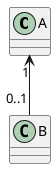
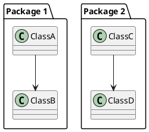
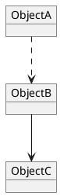
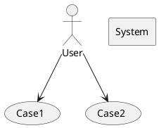
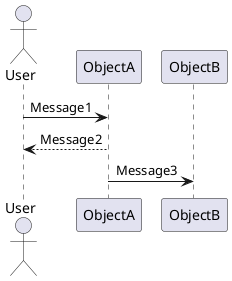
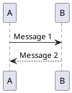

# UML(统一建模语言)基础教程

## UML 概述

UML（Unified Modeling Language，统一建模语言）是由对象管理组织（Object Management Group, OMG）制定的一个通用的、可视化的建模语言标准，可以用来描述、可视化、构造和文档化（specifying, visualizing, constructing, and documenting）软件密集型系统的各种工件，并且已被 ISO 确立为国际标准。

**UML（统一建模语言）最初确实是为面向对象方法设计的，但它并不仅限于面向对象建模**。UML 可以用于描述和表示各种类型的系统和问题领域，不仅局限于面向对象的软件分析和设计。

目前最新版本的 UML 名为 UML2。

### UML 概念模型

UML 概念模型主要包含三个部分：
1. 事物（Things）
2. 关系（Relationship）
3. UML 图（Diagrams）

### UML 适用和不适用的场景

**使用场景**：
1. 项目采用了 Object-Oriented 的方法论
2. 问题复杂，需要更加抽象的方式来概括描述，抓住问题本质，同时提高交流效率
3. 方案需要归档，已便后续复用，减少重复开发成本

**不适用场景**：
1. OO 技术使用很少，项目中现有的方式已经完全适用
2. 需求实现难度低，文字描述就可以阐述清楚

### OO 基本概念

[面向对象的基本概念](work/methodology/SoftwareEngineering/Analysis-and-Design/Object-Oriented-Design/面向对象的基本概念.md)

## UML Things（事物）

结构事物（Structural Thing）：UML 模型中的名词

行为事物（Behavioral Thing）：UML 模型中的动词

分组事物（Grouping Thing）：UML 模型中的结构

注释事物（Annotational Thing）：UML 模型的注解部分

## UML Relationship (关系)

UML 中本节的内容虽然介绍的是 UML Relationship，但实际上官方的 UML Relationship 中仅仅介绍了部分 Diagram 中的 Relationship，而非全部。

UML Relationship 主要介绍了类图（Class Diagram）、对象图（Object Diagram）、包图 （Package Diagram），和组合结构图（Composite Structure Diagram）中各个组件元素之间的关系，以及其对应的图形符号。

而在其他的 UML 图中，如用例图（Use Case Diagram）、构件图（Component Diagram）、部署图（Deployment Diagram）中，各个组件元素之间的关系，并不完全和本节中的 Relationship 一一对应，如果想要获知各个 Diagram 中的 Relationship，需要到对应的章节进行查看。

### 依赖（Dependency）
若 A 使用了 B，则表明 A 依赖于 B。

### 关联（Association）

关联（Association）是一种强语义联系的结构关系，表名两个事物之间存在明确的、稳定的语义联系。聚合（Aggregation）和组合（Combination）是两种不同类型的关联关系。

在关联关系的图形符号中，可以使用实线+箭头，也可以不使用箭头，单独使用实线，默认也视为关联关系，不过是双向关联。

#### 关联关系-聚合（Aggregation）
即Has-a 的关系

#### 关联关系-组合（Combination）
即 contains-a 的关系

### 泛化（Generalization）
即继承（extend）

### 实现（Realization）

## UML Diagrams（图）

建议参考《UML2 面向对象分析与设计（第 2 版）》，2.5 应用 UML2 建模

### 结构图（Structural Diagrams）

#### 包图（Package Diagrams）

#### 类图（Class or Structural Diagrams）

#### 对象图（Object Diagrams）

#### 组合结构图（Composite Structure Diagrams）

#### 组件图（Component Diagrams）

#### 部署图（Deployment Diagrams）

### 行为图（Behavioral Diagrams）

#### 用例图（Use Case Diagrams）

作用：用于描述 Actor 和 System 中的 Use Case 之间的联系，常用于业务分析和需求分析阶段。

组成元素：参与者（Actor）、用例（Use Case）、关系（Relationship）、系统（System）。

关系：关联（Association）、泛化（Generalization）、包含（include）、扩展（Extend）。

#### 活动图（Activity Diagrams）

#### 状态图、状态机图（State Machine Diagrams）

#### 通信图（Communication Diagrams）

#### 协作图（Collaboration Diagram）

#### 顺序图（Sequence Diagrams）

#### 时序图（Timing Diagrams）

#### 交互概览图（Interaction Overview Diagrams）

## UML 工具

### PlantUML

PlantUML是一种开源工具，定义了一种特殊的描述性语言来表示图表，基于这些描述语言可以生成对应的可视化图表，包括UML（统一建模语言）图形。

它允许开发人员和设计师使用纯文本来描述系统的结构、行为和交互，然后自动生成相应的图形表示。

使用PlantUML，您可以使用简单的文本语法来定义类、接口、关系、活动、时序等元素，并通过解析这些文本描述生成对应的图形。它支持多种类型的UML图，包括类图、时序图、活动图、用例图、组件图等。

https://github.com/plantuml/plantuml

https://www.plantuml.com/
https://www.planttext.com/

[微信公众号-程序媛山楂-神仙级UML工具，助你高效绘制流程图～](https://mp.weixin.qq.com/s/qyE4dpiwqfBpMbwR6TH68Q)

### Mermaid

Mermaid 是一个开源的 JavaScript 库，用于绘制流程图、时序图、类图和其他各种图表。它使用简洁的文本语法来描述图表结构，并将其转换为可视化图形。Mermaid 可以直接嵌入到 Markdown 文档、网页或其他文档中，以创建可交互和易于阅读的图表。

### ProcessOn

Web网页应用，云端存储，部分功能免费

https://www.processon.com/

[微信公众号-ProcessOn-产品经理常用UML图之「用例图」，附8张优质实例图！](https://mp.weixin.qq.com/s/_ZmXacP3MYRLK_GwBnLWYw)

### Visual Paradigm

Desktop桌面应用，收费，但同时支持社区免费版本

https://www.visual-paradigm.com/cn/download/community.jsp

[微信公众号-陶朱公Boy-绝杀processOn，这款UML画图神器，阿里字节都用疯了，你还不知道？](https://mp.weixin.qq.com/s/WWqbBMS7-3TNGcOXLJ26KQ)

### Enterprise Architect

Desktop桌面应用，收费，提供30天试用版，同时支持学术license

## 参考链接
1. [Wiki-Unified Modeling Language](https://en.wikipedia.org/wiki/Unified_Modeling_Language)
2. [SparxSystems - UML2 Tutorial](https://sparxsystems.com/resources/tutorials/uml2/index.html)
3. [Tutorialspoint - UML Tutorial](https://www.tutorialspoint.com/uml/index.htm)
4. 《UML2面向对象分析与设计（第2版）》-清华大学出版社
5. [Bilibili-北京航空航天大学-软件学院-UML2面向对象分析与设计](https://www.bilibili.com/video/BV1fq4y1q7KP)
6. [清华大学出版社-UML2面向对象分析与设计（第2版）-资源下载](http://www.tup.tsinghua.edu.cn/booksCenter/book_07138701.html#)
7. [阿里巴巴-Java开发手册(黄山版)](https://github.com/alibaba/p3c)
